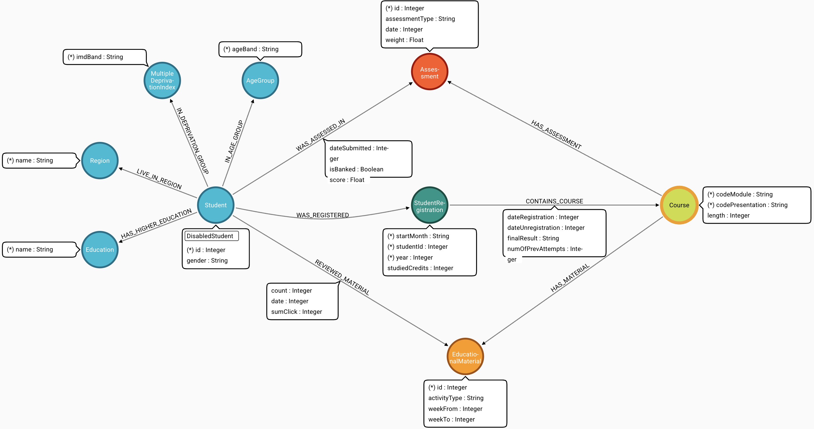

# OULAD as a Neo4j graph

Loads the [Open University Learning Analytics Dataset](https://analyse.kmi.open.ac.uk/open-dataset)
into Neo4j as a property graph, then runs graph analytics over it with
[Aura Graph Analytics](https://neo4j.com/docs/aura/graph-analytics/) — engagement cohorts,
node embeddings, and outcome prediction.

The full graph is **66,920 nodes and 8,818,076 relationships**, loaded in about seven minutes.

---

## The graph



Nine node labels, ten relationship types. `Student` also carries a secondary `DisabledStudent`
label where applicable. Outcomes live on `CONTAINS_COURSE` as `finalResult`, not on the student.

**All of it is defined in [`config.yaml`](config.yaml)** — labels, relationship types, Cypher,
source columns, join keys. The Python is a generic driver over that config, so adding a label or
a relationship is normally a config-only change.

---

## Quick start

### 1. Load the graph

[](https://colab.research.google.com/github/jose-alvarado-guzman/oulad/blob/main/notebooks/oulad_data_load.ipynb)
&nbsp;`notebooks/oulad_data_load.ipynb`

Or locally, against a `.env` you fill in from [`src/.env.example`](src/.env.example):

```bash
pip install -r requirements.txt
cd src && python -m oulad
```

It downloads the 44.6 MiB archive, reshapes seven CSVs with pandas, and loads them. Re-running
is safe: node loads `MERGE` and relationship loads are guarded, so a second pass creates nothing.

### 2. Analyse it

| notebook | what it does | |
| --- | --- | --- |
| `aga_student_cohorts.ipynb` | node similarity → Louvain engagement cohorts → outcome cross-tab | [](https://colab.research.google.com/github/jose-alvarado-guzman/oulad/blob/main/notebooks/aga_student_cohorts.ipynb) |
| `aga_outcome_prediction.ipynb` | FastRP embedding → node classification pipeline | [](https://colab.research.google.com/github/jose-alvarado-guzman/oulad/blob/main/notebooks/aga_outcome_prediction.ipynb) |
| `aga_fastpath_journeys.ipynb` | event chain → FastPath sequence embedding → classification, with a cutoff sweep | [](https://colab.research.google.com/github/jose-alvarado-guzman/oulad/blob/main/notebooks/aga_fastpath_journeys.ipynb) |

Each opens its own analytics session and deletes it afterwards. Only the FastPath notebook writes
to the database, and it removes what it wrote.

---

## What the analysis found

Predicting whether a student passes, from engagement and demographics only — no assessment
scores, since those determine the outcome by definition.

**Recommended model: FastPath sequence embedding + click volume, cut at day 90.** Measured on
holdouts it never trained on, in two modules:

| cutoff | module | flagged | recall | precision | accuracy |
| --- | --- | --- | --- | --- | --- |
| day 30 | GGG | 112 | 0.231 | 0.482 | 0.635 |
| day 30 | BBB | 446 | 0.386 | 0.702 | 0.670 |
| **day 90** | **GGG** | 133 | **0.372** | **0.722** | 0.717 |
| **day 90** | **BBB** | 520 | **0.528** | **0.838** | 0.755 |
| whole journey | GGG | 204 | 0.759 | 0.971 | 0.902 |
| whole journey | BBB | 677 | 0.776 | 0.950 | 0.887 |

At day 90 it flags **fewer** students than a click-volume model and catches **more** of the
failures, in both modules — 133 flags catching 96 against volume's 163 catching 68 on GGG, 520
catching 436 against 591 catching 416 on BBB. That is the clearest case for a graph embedding in
this repository.

Three things worth knowing before reading those numbers as a win:

- **Those are holdout figures, and getting there changed the answer.** GDS does not expose which
  nodes its internal split held back, so evaluating over every student mixes training data in. That
  inflated GGG's day-30 precision from 0.482 to **0.932** and produced a confident recommendation
  for a cutoff that is close to a coin flip. Accuracy barely moved across the same gap, which is
  why it is the wrong metric to check an evaluation with. Only the embedding models inflated —
  every click-volume baseline came in within ±0.015 — because one logged feature cannot memorise
  4,500 training rows and 129 features can.
- **Two modules, and they disagree on the number.** Day-90 precision is 0.722 on GGG and 0.838 on
  BBB for identical code. The recommendation replicates; its value does not transfer. Re-measure
  per module.
- **The whole-journey row is hindsight.** The embedding reads *when activity stopped*, which for a
  withdrawal is the label. Once a presentation is over you already have `finalResult`.
- **Click volume alone is not a fallback early.** It reaches 0.766–0.825 precision retrospectively
  but only 0.382–0.704 across days 30 to 90, against 0.482–0.838 for the embedding.

A FastRP topology embedding, by contrast, was worth **+0.4 accuracy points** over one logged
aggregate and collapsed to a constant classifier on its own.

And the earliest trigger is not a model at all. Students still registered but silent at **day 7**
fail or withdraw at **0.736** against a 0.473 base rate — one `NOT EXISTS` clause, 83 days before
the model above can say anything. It does not replace the model, which wins on both precision and
recall; it catches the students who never start, while the model catches those who start and fade.
Restricted to students the rule does *not* flag, the model's precision **rises** to 0.760 on GGG
and 0.856 on BBB, so the two overlap without cannibalising each other.
[`docs/early-warning-rule.md`](docs/early-warning-rule.md) has the sweep, the per-module spread,
and the confounded 88.1% figure this README used to quote in its place.

**[`docs/model-selection.md`](docs/model-selection.md)** has the full record: every method, every
number, and the conclusions that had to be retracted along the way.

---

## Local development

```bash
python -m venv .venv && source .venv/bin/activate
pip install -e '.[dev]'
python -m pytest                      # 72 tests, offline, under a second
```

The suite needs no database and no network. Tests that use the real CSVs skip themselves when
`Data/` is absent, since it is gitignored.

### Credentials

Two groups, both defined in [`src/oulad/credentials.py`](src/oulad/credentials.py) and resolved
from — in order — the process environment, the Google Colab secret store, then a `.env` file.

| group | keys | needed by |
| --- | --- | --- |
| `ETL_SECRETS` | `NEO4J_URI`, `NEO4J_USERNAME`, `NEO4J_PASSWORD` | loading the graph |
| `AGA_SECRETS` | `AURA_CLIENT_ID`, `AURA_CLIENT_SECRET`, `AURA_PROJECT_ID` | opening an analytics session |

`NEO4J_DATABASE` and `AURA_INSTANCEID` are optional; the instance id is derived from the
connection URI when absent. Copy [`src/.env.example`](src/.env.example) to `src/.env` and fill it
in — that file is gitignored, as is anything matching `.env.*`.

The `AURA_*` credentials come from the Aura console under your project's API credentials, and are
separate from the database login. The client secret is shown **once**, at creation.

---

## Layout

```
config.yaml                  the graph model: labels, relationships, Cypher
src/oulad/                   the loading pipeline
  __main__.py                orchestrator
  datasource.py              download and read the CSVs
  nodes.py, relationships.py reshape and load, with post-load QA
  credentials.py             Colab secrets, .env, and the two credential groups
notebooks/                   one loader, three analytics notebooks
scripts/zero_activity_rule.py  the early-warning measurement, offline
docs/model-selection.md      what was tried, what it scored, what was wrong
docs/early-warning-rule.md   the zero-activity rule: sweep, per-module, the query
tests/                       72 offline tests
requirements.txt             ETL dependencies
requirements-aga.txt         analytics dependencies (deliberately not a superset)
```

`Data/`, `Logs/` and `Result/` are gitignored; the loader creates them.

---

## Notes

**Dependencies are pinned with upper bounds** at the next major version — `pyneoinstance` 4 and
`neo4j` 6 both carried breaking changes, and `graphdatascience` is pinned exactly because its
session API is still in alpha and moves between releases.

**`traitlets>=5.10` is pinned although nothing here imports it.** `pyneoinstance` pulls in
`neo4j-viz`, which evaluates `traitlets.Instance[...]` at import time; Colab ships 5.7.1, where
that raises. Without the floor, `import pyneoinstance` fails in Colab.

**The dataset URL moved.** The address in the original OULAD paper now redirects to a homepage
and serves HTML. The live archive is linked from the
[OU Analyse dataset page](https://research.stem.open.ac.uk/ouanalyse/dataset/).

---

## Licence

[GPL-3.0-or-later](LICENSE). The OULAD dataset is published by The Open University under
CC BY 4.0.
