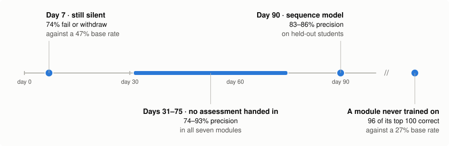
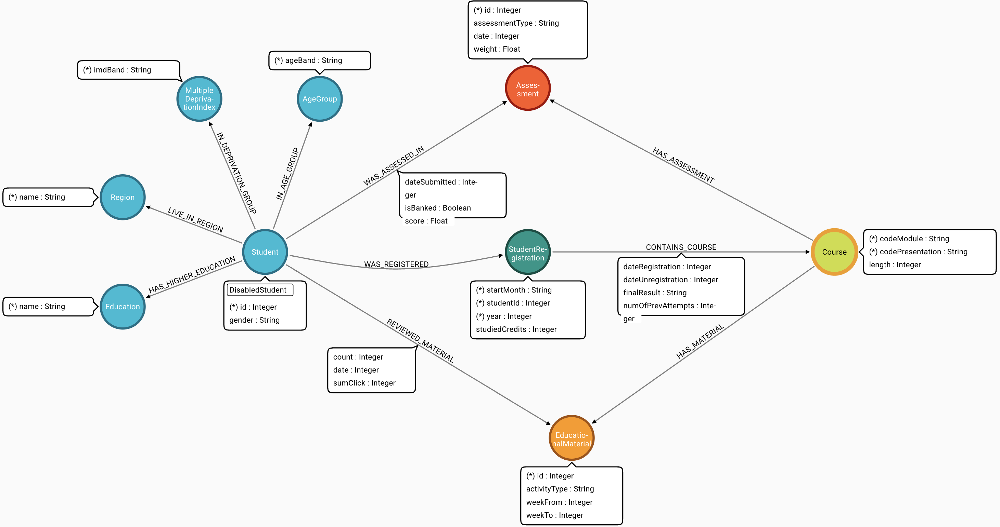

# Building an Early-Warning System for Student Failure

### Which students are going to fail, and how early can you tell?

[](LICENSE)
[](pyproject.toml)
[](https://colab.research.google.com/github/jose-alvarado-guzman/oulad/blob/main/notebooks/oulad_data_load.ipynb)

An early-warning study on the [Open University Learning Analytics Dataset](https://research.stem.open.ac.uk/ouanalyse/dataset/)
— 32,593 module registrations across seven modules, of which more than half end in a fail or a
withdrawal. The question is the one a course team would ask: **who should we contact, and when?**

Students are scored on **behaviour only** — what they clicked, in what order, and whether they
handed work in. Never on assessment *scores*, which determine the outcome by definition, and never
on demographics. Every model figure below is measured on students the model never trained on.

## Two findings

> **1. Students who will fail can be identified early, from behaviour alone.**
> The warning sharpens as the course goes on: silence at day 7, then the first missed assessment,
> then a day-90 model at **83–86% precision**.
>
> **2. The system transfers to modules it was never trained on.**
> One stored model, applied to an unseen module without retraining, produced a 100-student
> worklist that was **96% correct** — and a model retrained on that module did no better.

<picture>
  <source media="(prefers-color-scheme: dark)" srcset="imgs/early_warning_timeline_dark.svg">
  
</picture>

## The answer, in the order a course sees it

| when | signal | how sharp |
| --- | --- | --- |
| **day 7** | still registered, has not clicked anything | **74%** go on to fail or withdraw, against a 47% base rate — one Cypher clause, no model |
| **days 31–75** | has not submitted any assessment due so far | **74–93%** precision across all seven modules — the sharpest single signal in the dataset |
| **day 90** | model over the sequence of activity, click volume and submission | **83–86%** precision, and it catches students who started and faded, whom the day-7 rule misses |
| **any module** | the same model, trained once and applied to a module it never saw | a 100-student worklist that is **96% correct**, among students the missed-assessment rule does not flag (base rate 27%) |

The day-7 rule catches the students who never start; the model catches the ones who start and
fade. They overlap without cannibalising each other. The rows are measured on different
populations and modules, so read them as a timeline rather than a ranking — the linked documents
have the like-for-like comparisons.

## How the numbers were checked

The data lives in Neo4j and the models run in [Aura Graph Analytics](https://neo4j.com/docs/aura/graph-analytics/).

- **Every model figure is a holdout figure.** Evaluating without a true holdout inflated day-30
  precision from 0.48 to 0.93, so the numbers above come only from students the model never saw.
- **Hindsight is excluded.** Scoring the whole course reaches 0.93 accuracy, but it reads *when
  activity stopped*, which for a withdrawal is the label itself. The timeline only uses what is
  observable on the day it names.

[`docs/model-selection.md`](docs/model-selection.md) is the full record: every method, every
number, and the conclusions that had to be retracted along the way.

---

## Results in detail

**Recommended model: a FastPath sequence embedding of each student's journey, plus click volume and
four assessment-submission features, cut at day 90.** It is the top-precision configuration in both
modules it was measured on — 0.832 on GGG and 0.855 on BBB. It was reached in two steps.

**First, the sequence embedding with click volume**, trained and scored in a GDS pipeline on
held-out students:

| cutoff | module | flagged | recall | precision | accuracy |
| --- | --- | --- | --- | --- | --- |
| day 30 | GGG | 112 | 0.231 | 0.482 | 0.635 |
| day 30 | BBB | 446 | 0.386 | 0.702 | 0.670 |
| **day 90** | **GGG** | 133 | **0.372** | **0.722** | 0.717 |
| **day 90** | **BBB** | 520 | **0.528** | **0.838** | 0.755 |
| whole journey | GGG | 204 | 0.759 | 0.971 | 0.902 |
| whole journey | BBB | 677 | 0.776 | 0.950 | 0.887 |

At day 90 it flags **fewer** students than a click-volume model and catches **more** of the
failures, in both modules — 133 flags catching 96 against volume's 163 catching 68 on GGG, 520
catching 436 against 591 catching 416 on BBB. That is the clearest case for a graph embedding in
this repository. Click volume alone is no substitute early: it reaches 0.382–0.704 precision across
days 30 to 90, against 0.482–0.838 for the embedding.

**Then, assessment submission.** Measured in a separate offline harness over the same embeddings
(30% holdout, seed 42), adding four scale-free submission features to the embedding and click
volume moves precision from 0.549 to **0.832 on GGG** (+0.283) and from 0.764 to **0.855 on BBB**
(+0.092). Those harness figures are comparable with each other, not with the GDS table above.
[`docs/assessment-submission.md`](docs/assessment-submission.md) has every arm.

Three things worth knowing before reading those numbers:

- **The holdout changed the answer.** GDS does not expose which nodes its internal split held
  back, so evaluating over every student mixes training data in. That inflated GGG's day-30
  precision from 0.482 to **0.932** and produced a confident recommendation for a cutoff that is
  close to a coin flip. Accuracy barely moved across the same gap, which is why it is the wrong
  metric to check an evaluation with.
- **The two modules disagree on the number.** Day-90 precision is 0.722 on GGG and 0.838 on BBB
  for identical code. The recommendation replicates; its exact value does not. Re-measure per
  module.
- **The whole-journey row is hindsight.** Once a presentation is over you already have
  `finalResult`.

**It transfers to a module it never saw.** Trained on BBB, stored in the Aura model catalog and
applied to EEE in a separate session. Over all of EEE its top 200 are 100% correct, but that is
mostly the missed-every-assessment feature, which on its own flags 388 students of whom 98.7% fail.
The informative test is the 2,244 students that feature does *not* flag: there a 100-student
worklist is **96% correct against a 26.7% base rate** — lift 3.6. A control retrained on EEE itself
did no better. `notebooks/aga_score_unseen_module.ipynb` runs it.

**It complements the day-7 rule rather than duplicating it.** Restricted to students the rule does
*not* flag, the day-90 embedding model's precision **rises** to 0.760 on GGG and 0.856 on BBB.
[`docs/early-warning-rule.md`](docs/early-warning-rule.md) has the rule's sweep and per-module
spread.

---

## Limitations

- **One dataset.** OULAD covers seven modules of one distance-learning university over 2013–2014.
  Nothing here has been checked on another institution or a more recent cohort.
- **Few modules for the model.** The day-90 model was measured on GGG and BBB and its transfer on
  EEE only, each with one random seed. The submission rule was measured on all seven.
- **Students who never engage cannot be scored by the model.** A student with no activity has no
  journey to embed — 1,287 of 7,909 BBB registrations, for instance. The day-7 and submission rules
  are what cover them.
- **Prediction, not intervention.** This shows who is likely to fail. It does not show that
  contacting them changes the outcome; that needs a trial.
- **No fairness audit yet.** Flag rates have not been compared across demographic groups. Do that
  before using the worklist on real students.

## Responsible use

The recommended model sees only behaviour: the sequence of activity, click volume, and whether work
was handed in. It does not use age, gender, region, deprivation band, prior education or
disability. `aga_outcome_prediction.ipynb` explores a demographic neighbourhood as research; it is
not the model this repository recommends for flagging students.

Treat a flag as a reason to offer support, not as a judgement. At 83–86% precision, roughly one
flagged student in six is on track to pass. The output is for outreach — never for grading,
admissions or any penalty.

---

## Quick start

### Prerequisites

- **A Neo4j AuraDB instance** large enough for the full graph — 66,920 nodes and 8,818,076
  relationships, beyond the Free tier's limits.
- **Aura Graph Analytics** enabled for the project, with API credentials (client id, client secret,
  project id) from the Aura console. These are separate from the database login, and the client
  secret is shown **once**, at creation.
- **Google Colab**, or Python 3.11+ locally.

**Analytics sessions are billed separately from AuraDB.** Every notebook creates its session with
a 2-hour time-to-live and deletes it at the end, so an abandoned run stops costing within two hours.

The six credentials go into Colab's Secrets panel or a local `.env`; see
[Credentials](#credentials).

### 1. Load the graph

[](https://colab.research.google.com/github/jose-alvarado-guzman/oulad/blob/main/notebooks/oulad_data_load.ipynb)
&nbsp;`notebooks/oulad_data_load.ipynb`

Or locally, against a `.env` you fill in from [`src/.env.example`](src/.env.example):

```bash
pip install -r requirements.txt
cd src && python -m oulad
```

It downloads the 44.6 MiB archive, reshapes seven CSVs with pandas, and loads them in about seven
minutes. Re-running is safe: node loads `MERGE` and relationship loads are guarded, so a second
pass creates nothing.

### 2. Analyse it

Four notebooks, in the order the system was built. The last depends on the model the third one
stores.

**1. `aga_student_cohorts.ipynb` — do students who engage alike end up alike?**
[](https://colab.research.google.com/github/jose-alvarado-guzman/oulad/blob/main/notebooks/aga_student_cohorts.ipynb)

The exploratory step. Groups students by the course materials they share and checks whether those
cohorts track final results, and finds the materials that draw the most attention.

*How:* node similarity → Louvain engagement cohorts → outcome cross-tab → degree centrality.

**2. `aga_outcome_prediction.ipynb` — can a student's place in the graph predict whether they pass?**
[](https://colab.research.google.com/github/jose-alvarado-guzman/oulad/blob/main/notebooks/aga_outcome_prediction.ipynb)

The first predictive model. Describes each student by what surrounds them — the materials they used
and the age, region, education and deprivation groups they belong to — and trains a classifier on
it, against a click-volume baseline.

*How:* FastRP embedding → node classification pipeline.

**3. `aga_fastpath_journeys.ipynb` — how early can failure be flagged?**
[](https://colab.research.google.com/github/jose-alvarado-guzman/oulad/blob/main/notebooks/aga_fastpath_journeys.ipynb)

The core of the early-warning system. Turns each student's activity into a journey — what they did,
in what order, and how intensely — and measures how well it predicts failure at day 30, 60 and 90.
Stores the recommended day-90 model for reuse.

*How:* event chain → FastPath sequence embedding → node classification, cutoff sweep, model store.

**4. `aga_score_unseen_module.ipynb` — put the system to work on a new module.**
[](https://colab.research.google.com/github/jose-alvarado-guzman/oulad/blob/main/notebooks/aga_score_unseen_module.ipynb)

The deliverable. Applies the stored model to a module it was never trained on and produces a ranked
worklist of students likely to fail or withdraw — then checks that list against the real outcomes,
so the worklist is something you can trust rather than assume.

*How:* load stored model → predict → score the worklist against `finalResult`.

Each opens its own analytics session and deletes it afterwards. Only `aga_outcome_prediction.ipynb`
leaves the database untouched:

- **`aga_student_cohorts.ipynb`** sets an `engagementCohort` property on each `Student` and
  **keeps it**, so cohorts stay queryable without a session. Its last cell removes the property
  again, but only if you set `REVERT = True`. It adds no nodes or relationships.
- **`aga_fastpath_journeys.ipynb`** and **`aga_score_unseen_module.ipynb`** build a temporary chain
  of `Interaction` nodes and set feature properties on `Student`, and remove both at the end.

---

## The graph



Nine node labels, ten relationship types. `Student` also carries a secondary `DisabledStudent`
label where applicable. Outcomes live on `CONTAINS_COURSE` as `finalResult`, not on the student.

**All of it is defined in [`config.yaml`](config.yaml)** — labels, relationship types, Cypher,
source columns, join keys. The Python is a generic driver over that config, so adding a label or
a relationship is normally a config-only change.

---

## Local development

```bash
python -m venv .venv && source .venv/bin/activate
pip install -e '.[dev]'
python -m pytest                      # 72 tests, offline, under a second
```

The suite needs no database and no network. Tests that use the real CSVs skip themselves when
`Data/` is absent, since it is gitignored.

### Credentials

Two groups, both defined in [`src/oulad/credentials.py`](src/oulad/credentials.py) and resolved
from — in order — the process environment, the Google Colab secret store, then a `.env` file.

| group | keys | needed by |
| --- | --- | --- |
| `ETL_SECRETS` | `NEO4J_URI`, `NEO4J_USERNAME`, `NEO4J_PASSWORD` | loading the graph |
| `AGA_SECRETS` | `AURA_CLIENT_ID`, `AURA_CLIENT_SECRET`, `AURA_PROJECT_ID` | opening an analytics session |

`NEO4J_DATABASE` and `AURA_INSTANCEID` are optional; the instance id is derived from the
connection URI when absent. Copy [`src/.env.example`](src/.env.example) to `src/.env` and fill it
in — that file is gitignored, as is anything matching `.env.*`.

---

## Layout

```
config.yaml                  the graph model: labels, relationships, Cypher
src/oulad/                   the loading pipeline
  __main__.py                orchestrator
  datasource.py              download and read the CSVs
  nodes.py, relationships.py reshape and load, with post-load QA
  credentials.py             Colab secrets, .env, and the two credential groups
notebooks/                   one loader, four analytics notebooks
scripts/
  zero_activity_rule.py            the day-7 rule, offline
  assessment_submission.py         non-submission as a trigger, offline
  assessment_submission_graph.py   Cypher port plus reconciliation gate
  assessment_submission_model.py   the submission-feature arms of the day-90 model
  model_marginal_value.py          the model on students the day-7 rule has not flagged
  readme_timeline.py               draws the timeline at the top of this README
docs/
  model-selection.md               what was tried, what it scored, what was wrong
  model-selection-process.pdf      the same record, typeset for reading or sharing
  early-warning-rule.md            the day-7 rule: sweep, per-module, the query
  assessment-submission.md         non-submission: the sharpest signal here
imgs/                        the graph model and the README timeline
tests/                       72 offline tests
requirements.txt             ETL dependencies
requirements-aga.txt         analytics dependencies (deliberately not a superset)
```

`Data/`, `Logs/` and `Result/` are gitignored; the loader creates them.

---

## Notes

**Dependencies are pinned with upper bounds** at the next major version — `pyneoinstance` 4 and
`neo4j` 6 both carried breaking changes, and `graphdatascience` is pinned exactly because its
session API is still in alpha and moves between releases.

**`traitlets>=5.10` is pinned although nothing here imports it.** `pyneoinstance` pulls in
`neo4j-viz`, which evaluates `traitlets.Instance[...]` at import time; Colab ships 5.7.1, where
that raises. Without the floor, `import pyneoinstance` fails in Colab.

**The dataset URL moved.** The address in the original OULAD paper now redirects to a homepage
and serves HTML. The live archive is linked from the
[OU Analyse dataset page](https://research.stem.open.ac.uk/ouanalyse/dataset/).

---

## Citation

The dataset is described in:

> Kuzilek, J., Hlosta, M. & Zdrahal, Z. Open University Learning Analytics dataset.
> *Scientific Data* **4**, 170171 (2017). <https://doi.org/10.1038/sdata.2017.171>

## Licence

[GPL-3.0-or-later](LICENSE). The OULAD dataset is published by The Open University under
CC BY 4.0.
